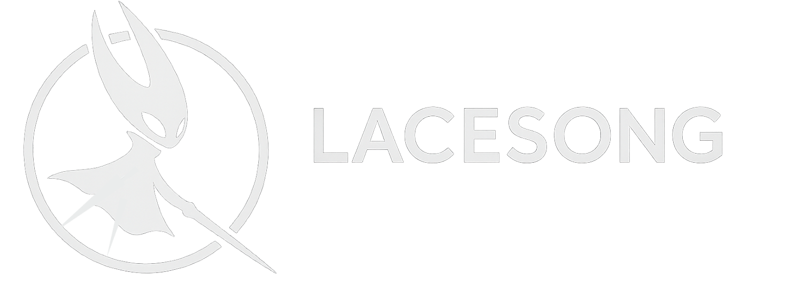

# Lacesong



A cross-platform mod management tool for Unity/Mono games, starting with Hollow Knight: Silksong. Built with .NET 9 and Avalonia UI, Lacesong runs natively on Windows, macOS, and Linux.

## Overview

Lacesong provides a simple, safe, and consistent way to install, manage, and update community mods. Inspired by tools like Lumafly and Scarab, it focuses on automation, safety, and cross-platform compatibility.

## Features

- **Cross-Platform UI** - Modern Avalonia interface with MVVM architecture running on Windows, macOS, and Linux
- **Automatic Game Detection** - Finds installations via Steam, Epic Games, GOG, Xbox Game Pass, or manual selection
- **BepInEx Management** - One-click installation with version selection and configuration
- **Comprehensive Mod Management** - Install from files or URLs with automatic dependency resolution
- **Conflict Detection** - Advanced detection and resolution for mod conflicts
- **Configuration Preservation** - Smart config merging during updates
- **Enhanced Backup System** - Restore points with metadata tracking before critical operations
- **Mod Index Integration** - Browse and install from centralized repositories
- **Signature Verification** - Cryptographic validation of mod files and downloads
- **Update Management** - Built-in updater with GitHub release integration
- **CLI Interface** - Full-featured command-line tool for advanced users and automation

## Tech Stack

**Core**: .NET 9, C#, BepInEx integration, JSON-based manifests  
**UI**: Avalonia (cross-platform MVVM), CommunityToolkit.Mvvm  
**Services**: Octokit (GitHub API), System.CommandLine (CLI)  
**Testing**: xUnit, Moq, FlaUI (UI automation)  
**Distribution**: Self-contained executables for Windows, macOS, Linux

## Installation

### Desktop Application

WIP

### Command Line Interface

Download the CLI package for your platform and extract it. Run `modman` (or `modman.exe` on Windows) from the command line.

See [USAGE.md](USAGE.md) for detailed commands and options

## Quick Start

### Desktop Application

1. Launch Lacesong - automatic game detection runs on startup
2. If needed, manually browse for your game installation
3. Install BepInEx with one click
4. Browse and install mods from the catalog or local files
5. Manage mods: enable, disable, update, or uninstall

### CLI Examples

```bash
# Basic operations
modman detect-game
modman install-bepinex --version 5.4.22 --backup
modman install-mod "path/to/mod.zip"
modman list-mods
modman enable-mod "mod-id"

# Advanced features
modman search-mods --category UI --verified
modman check-updates
modman detect-conflicts
modman create-restore-point "before-update"
```

For comprehensive documentation, see [USAGE.md](USAGE.md)

## Architecture

Built with service-oriented design principles:
- Clean interfaces for all core services (game detection, BepInEx management, mod operations)
- Dependency injection with testable, mockable components
- Comprehensive data models for installations, mods, and configurations
- Safe atomic file operations with cross-platform path handling

## Safety Features

- **Dependency Resolution** - Automatic validation and installation with version constraint support
- **Signature Verification** - Cryptographic validation (SHA256/SHA512/MD5) of mod files
- **Safe Installation** - Staged installs with validation pipeline and atomic rollback
- **Backup System** - Automatic restore points with metadata before critical operations
- **Conflict Detection** - File, dependency, and load order conflict resolution
- **Permission Handling** - Cross-platform elevation with protected location detection

## Development

### Build System

Build scripts for all platforms:
```bash
# Windows
build.bat

# macOS/Linux
./build.sh
```

Produces self-contained executables with all dependencies included.

### Testing

Comprehensive test coverage with xUnit and UI automation:
```bash
dotnet test
```

## Contributing

Contributions welcome! Open issues for bugs or features, submit PRs for improvements. Please follow existing code style and include tests for new features.

## License

MIT License - See [LICENSE](LICENSE) for details.

## Disclaimer

Lacesong is a community-driven tool, not affiliated with Team Cherry or Hollow Knight: Silksong. Use at your own risk.

---

**Documentation**: See [USAGE.md](USAGE.md) for detailed usage instructions.

**Contact**: wwdarrenwei@gmail.com (email) or stitchsages (discord)
