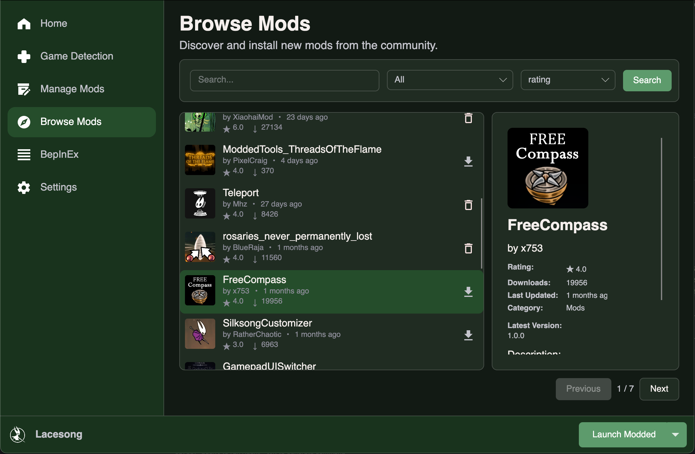

# Lacesong

A cross-platform mod management tool for Unity/Mono games, starting with Hollow Knight: Silksong. Built with .NET 9 and Avalonia UI, Lacesong runs natively on Windows, macOS, and Linux.

## Overview

Lacesong provides a simple, safe, and consistent way to install, manage, and update community mods. Inspired by tools like Lumafly and Scarab, it focuses on automation, safety, and cross-platform compatibility for Hollow Knight: Silksong.

## Screenshots

Mod catalog screenshot showing mod management and "Moss Groto" theme.

## Tech Stack

**Core**: .NET 9, C#, BepInEx integration, JSON-based manifests  
**UI**: Avalonia (cross-platform MVVM), CommunityToolkit.Mvvm  
**Testing**: xUnit, Moq, FlaUI (UI automation)  

## Installation

### Desktop Application

Lacesong is available as a cross-platform desktop application:

1. **Download**: Get the latest release from [GitHub Releases](https://github.com/pecan-solutions/lacesong/releases)
2. **Install**: Run the installer for your platform (Windows, macOS, or Linux)
3. **Launch**: Start Lacesong and follow the setup wizard

## Contributing

We welcome contributions! Whether you're fixing bugs, adding features, or improving documentation, your help is appreciated.

Please read our [CONTRIBUTING.md](CONTRIBUTING.md) for:
- Development environment setup
- Code style guidelines and conventions
- Testing requirements
- Pull request process

Quick start: Open issues for bugs or features, submit PRs for improvements. All contributions should include tests.

## License

Apache 2.0 License - See [LICENSE](LICENSE) for details.

## Disclaimer

Lacesong is a community-driven tool, not affiliated with Team Cherry or Hollow Knight: Silksong. Use at your own risk.

## Credits

    
Expand

- [wdarrenww](https://github.com/wdarrenww) (Darren Wei) - Creator of Lacesong, Lead Developer, Planner/PM

- lavenderpres (Presley) - Assistant Planning/PM, Senior Developer, Avalonia Translation

- piespecan (Iris) - Senior Developer, Avalonia and WPF UI Development, Avalonia Translation

- Leonardo - Developer, Planning, WPF development

- Joseph - Developer, Avalonia UI

- Sylvie - Developer, Avalonia UI and Mod Logic

Thanks in advance to all future contributors!

---

**Documentation**: See [USAGE.md](USAGE.md) for detailed usage instructions.

**Contact**: wwdarrenwei@gmail.com (email) or stitchsages (discord)
