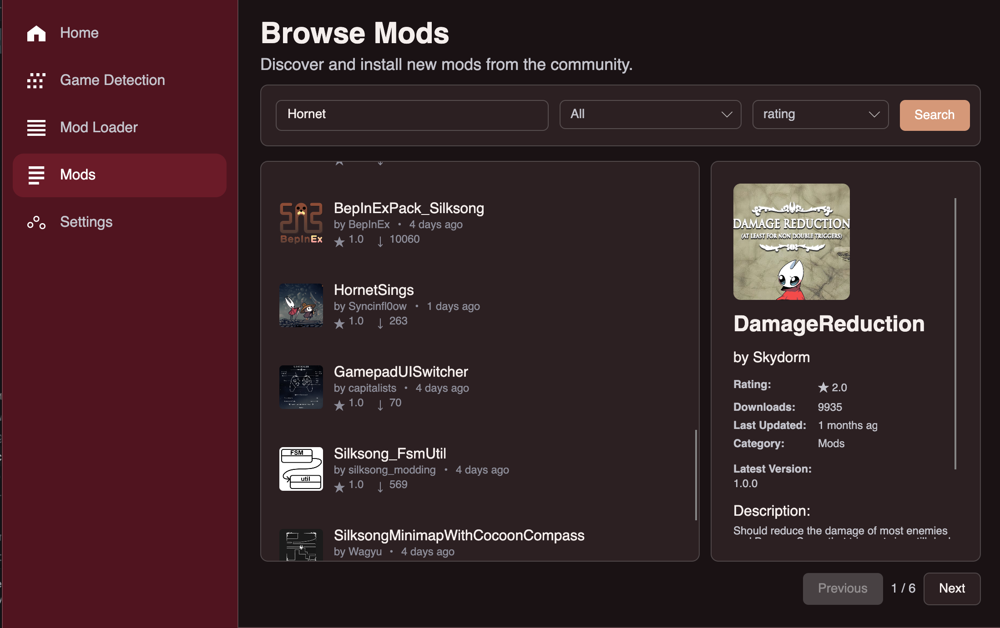

# Lacesong


A cross-platform mod management tool for Unity/Mono games, starting with Hollow Knight: Silksong. Built with .NET 9 and Avalonia UI, Lacesong runs natively on Windows, macOS, and Linux.

## Overview

Lacesong provides a simple, safe, and consistent way to install, manage, and update community mods. Inspired by tools like Lumafly and Scarab, it focuses on automation, safety, and cross-platform compatibility. Looking for contributors or developers.

## Features

- **Cross-Platform UI** - Modern Avalonia interface with MVVM architecture running on Windows, macOS, and Linux
- **Automatic Game Detection** - Finds installations via Steam, Epic Games, GOG, Xbox Game Pass, or manual selection
- **BepInEx Management** - One-click installation with version selection and configuration
- **Comprehensive Mod Management** - Install from files or URLs with automatic dependency resolution
- **Conflict Detection** - Advanced detection and resolution for mod conflicts
- **Configuration Preservation** - Smart config merging during updates
- **Enhanced Backup System** - Restore points with metadata tracking before critical operations
- **Mod Index Integration** - Browse and install from centralized repositories
- **Signature Verification** - Cryptographic validation of mod files and downloads
- **Update Management** - Built-in updater with GitHub release integration
- **CLI Interface** - Full-featured command-line tool for advanced users and automation

## Screenshots


Mod catalog screenshot showing Thunderstore integration and "The Marrow" theme.

## Tech Stack

**Core**: .NET 9, C#, BepInEx integration, JSON-based manifests  
**UI**: Avalonia (cross-platform MVVM), CommunityToolkit.Mvvm  
**Services**: Octokit (GitHub API), System.CommandLine (CLI)  
**Testing**: xUnit, Moq, FlaUI (UI automation)  
**Distribution**: Self-contained executables for Windows, macOS, Linux

## Installation

### Desktop Application

Desktop application is work in progress and needs to be tested on Linux first.

## Development

### Build System

Build scripts for all platforms:
```bash
# Windows
build.bat

# macOS/Linux
./build.sh
```

Produces self-contained executables with all dependencies included.

### Testing

Comprehensive test coverage with xUnit and UI automation:
```bash
dotnet test
```

## Contributing

Contributions welcome! Open issues for bugs or features, submit PRs for improvements. Please follow existing code style and include tests for new features.

## License

MIT License - See [LICENSE](LICENSE) for details.

## Disclaimer

Lacesong is a community-driven tool, not affiliated with Team Cherry or Hollow Knight: Silksong. Use at your own risk.

## Credits

- wwdarrenwei (Darren Wei) - Creator of Lacesong, Lead Developer, Planner/PM

- lavenderpres (Presley) - Assistant Planning/PM, Senior Developer, Avalonia Translation

- Iris - Senior Developer, Avalonia and WPF UI Development, Avalonia Translation

- Leonardo - Developer, Planning, WPF development

- Joseph - Developer, Avalonia UI assisting

Thanks in advance to all contributors!

---

**Documentation**: See [USAGE.md](USAGE.md) for detailed usage instructions.

**Contact**: wwdarrenwei@gmail.com (email) or stitchsages (discord)
